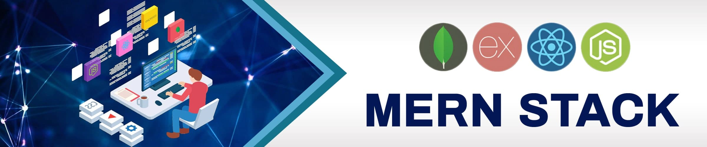

  

  <h1> Hi there, I'm Sohail Ahmad👋<a href="https://sohailahmaddev.netlify.app"></h1>

  

  
  
  
  

---

## 🌟 About Me

I am a passionate and dedicated MERN Stack as well as iOS/Android (Hybrid) Mobile App Developer. With a strong foundation in both front-end and back-end technologies, I specialize in building dynamic and responsive web applications. I also have experience in developing mobile applications. My goal is to deliver high-quality and efficient solutions that provide an excellent user experience.

- 👀 I'm experienced in full stack web development, mobile app development, and exploring new technologies.
- 🌱 I’m currently learning advanced Node.js and exploring serverless architecture.
- 💞️ I’m looking to collaborate on open-source projects and innovative web applications.
- 📫 How to reach me: sohailahmaddev@gmail.com
- ⚡ Fun fact: I love playing chess and coding challenges.

## 🛠️ Tech Stack

### Web Development

#### Front-End

#### Back-End

### Mobile Application Development

#### Hybrid

### Other Tools

---

## 👨‍💻 Experience

- React JS Developer at Pixel and Beam
- React/React Native Developer at AI Technologies
- Frontend Developer at Local Happeniz
- Frontend Developer at Xomacs

---

## 📈 GitHub Stats

  
  

## 🏆 GitHub Profile Trophy

  

---

## 📫 Contact Me

Feel free to reach out to me for any project collaborations or just to connect!

  
  
  <
